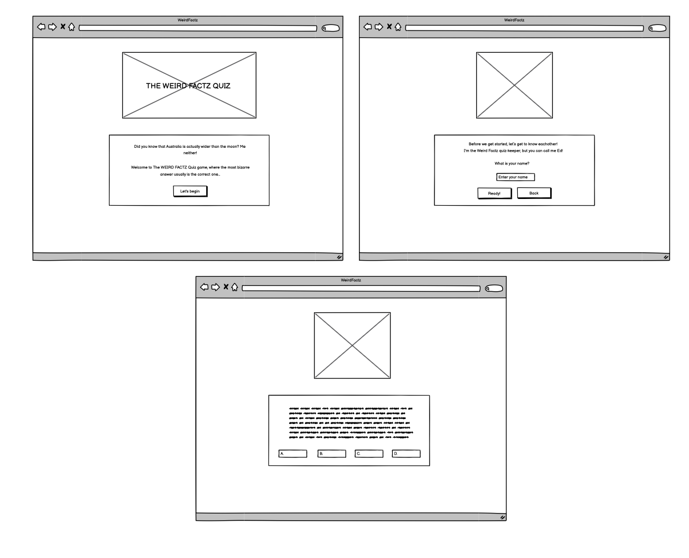

# The WEIRD FACTZ Quiz 

### The quiz website that will make you shake your head, saying "this can't be true". Yet somehow it weirdly is! 
---

## Description

The WEIRD FACTZ Quiz is a fun quiz game where some bizarre facts are revealed. The sole purpose is to learn something weirdly fascinating, while also having fun. As the theme of the game focuses on entertaining, it is suitable for anyone who enjoys to be able to say "DID YOU KNOW..." at the party or by the dinner table. It will definitely start a conversation to say the least!  

The user-friendly interface and simple, yet fun design makes it accessible to anyone interested in learning whilst playing and earning points for each correct answer.

Link to the quiz game [here](https://cryptiked.github.io/Weird-Factz-Quiz-/)

# Contents

* [User Experience](#user-experience-ux)
  * [Target Audience](#target-audience)
  * [User Stories](#user-stories)
  * [Quiz game Aim](#quiz-game-aim)

* [Design](#design)
  * [Color Scheme](#color-scheme)
  * [Typography](#typography)
  * [Imagery](#imagery)

* [Wireframes](#wireframes)

* [Features](#features)

* [Main page](#main-page)

* [Technologies Used](#technologies-used) 

* [Accessibility ](#accessibility)

* [Testing](#testing)
  * [Feature Testing](#feature-testing)
  * [Validator Testing](#validator-testing)
  * [Browser Testing](#browser-testing)
  * [Bugs](#bugs)

* [Features left to implement](#features-left-to-implement)

* [Deployment](#deployment)

* [Local Development ](#local-development) 
  * [How to fork>](#how-to-fork)
  * [How to clone](#how-to-clone)

* [Credits](#credits)
  * [Content](#content)
  * [Media](#media)
  * [Acknowledgement ](#acknowledgement)

---

## User Experience (UX)

- ### Target Audience
  
  -  Users who are looking for a fun way to learn some weird facts. 
    
- ### User Stories
  
  #### *First time visitor goals*
  
  - A user should be able to learn weird facts online whilst playing an interactive quiz game.
  - A user should be able to play the quiz on any device.
  - A user should be able to check their score.
  - A user should be able to intuitively play the quiz game.

  
-  ### Quiz game Aim

    - To increase knowledge about some weird facts.
    - To provide a easy-to-play experience.
    - To provide a fun experience.

---

## Design

-  ### Color scheme

The color scheme was based from one of my favorite colors, a deep sea blue. This was used as a the background color on all game pages. I used the same color as background color when creating all the images for the different game pages, for a cleaner look. As The Hero Image with its vibrant colors is the focal point when entering the gamesite, I opted to keep the overall color scheme for both text block and fonts quite neutral. But I made sure to keep contrasting colors for an more pleaserable user experience.

- Colors
  - I used #124b8d for background
  - I used 1C364B for buttons
  - I used #124b8d for hovering and chosing an answer option

 

- ### Typography

The font used throughout the website was imported from Googlefonts. I chose the ADLAM font because of its fun and soft look. I used font family to be able to keep the same text style throughout the website.

- Text colors
  - I used #124b8d for inside the text block, to match the overall design
  - I used #fffff for the buttons, for sufficient contrast
 

- ### Imagery

I opted to make all the images for the quiz game myself, to ensure they where customized for both my chosen content and design. I made sure that each image created suited the responding questions theme and that they varied in style (fotograph, animated, print etc.), to ensure it felt balanced.

---

## Wireframes

Wireframes was created for mobile device and desktop using balsamiq. I made three main wireframes for each device, the main page of the quiz, the enter your name and begin to play quiz page and a quiz question page.

[Back to top](<#contents>)

---

## Features

The quiz game contains of a main landing page, a enter name page, quiz pages and a score page. It is very easily navigated, intuitively used and responsive to all devices. There is one way to go and that's forward! When using a desktop it has a cursor that turns into a hand when hovering the buttons, on the mobile device it is simply your finger that's used.

- *Favicon*
  - A favicon is visible in the browser tab
    
 

- *Alert*
  - When entering a name an alert pops up welcoming the user and letting them know there are 7 questions ahead. 

  
-  ### Main page

Introduces the user to the game and theme. 

- *The Weird Factz quiz-banner*
  - The focal point of the landing page is the fun image, it is custom made through canva (as all other images). It reveals the name of the game paired up with some weird and fun emojis, to give the user a clue of what is ahead.
- *Text block*
  - There is a weird fact that introduces the user to the theme of the quiz.
- *Let's begin button*
  - At the bottom of the text block there is a button that invites the user to begin the game.
  

-  ### Enter name page

The game will not start unless a name is input with the allowed letters a-z. The name will also be stored throughout the entirety of the game.

- *Gif*
   -  A smiley that winks at the user 
- *Text block*
   - The quizkeeper a.k.a mascot Ed is introduced, and also invites the user to enter their name.
- *Ready button*
   - When the user wants to start the game, they simply press the ready button
- *Back button*
   - If the user is unsure, they can press the back button and gets redirected to the main page of the game.
 

### Quiz pages
  
The game consists of 7 quiz pages.
  
- *Image* 
   - Custom image to each question
- *Text block*
   - Question
- *Answer buttons*
   - Each quiz comes with four answer options, each option has its own button. There is only one correct answer. The option button pressed will indicate if the answer was correct (highlights in green for a delay of o,3 sec), or incorrect (highlights in red for a delay of 0,3 sec) and open the next question.

### Score page

Here the user gets a personalized greeting with their name, before getting to know their score out of 70 points possible. Each correct answer is 10 points.

- *The Weird Factz quiz-banner*
  - The main page image with the quiz name is used once more to conclude the results
- *Text block*
  - The results are given to the user by letting them know how many point they scored out of 70.
- *Try again button*
  - Lets the user try again, by navigating them back to the main page.
 

 [Back to top](<#contents>)
 
 ---

 ## Technologies Used

- HTML5 - Delivers the stucture and content for the quiz
- CSS3 - Provides the styling for the quiz
- JS5 - Makes the functions of the quiz work
- Balsamiq - Used to create wireframes for the quiz
- Gitpod - Used to develop the quiz and to push changes to Github repository 
- Github - Used to host and deploy the quiz
- VScode - Used initially to write and test code 
- Canva - Used to customize images for the quiz
- Favicon - Used to make favicon

## Accessibility

Throughout the developing of the website it has been of importance to ensure that it is as accessible as possible. This was achieved by:

  - Using semantic markup HTML
  - Using a hover hand signaling function in the desktop format, to ensure the user knows which button they press
  - Removing the hover hand signaling function for buttons when using mobile devices
  - Using colors that are contrasting to make it easy to read 

---

## Testing

The Weird Factz Quiz underwent rigorous testing to ensure functionality, usability, and compatibility across different browsers and devices. Validation tests confirmed the absence of errors in both HTML, CSS and JS code, with the exception of 3 undefined values in JS, however the undefined values are referencing to the sweetalert which is fully functioning. The website was tested on various browsers and screen sizes to ensure a consistent and optimal user experience.

- HTML validator test

- CSS validator test

- Lighthouse test: mobile 

- Lighthouse test: desktop

### Feature testing

### Validator Testing

- *HTML*
  - No errors were returned when passing through the official [W3C validator](https://validator.w3.org/).
- *CSS*
  - No errors were found when passing through the official [(Jigsaw) validator](https://jigsaw.w3.org/css-validator/).
- *JS*
  - No errors were found when passing through the official [(Jshint) validator](https://jigsaw.w3.org/css-validator/)

### Browser testing

### Bugs

During the testing of responsiveness on different dimensions, there was an issue that effects the answer buttons. I solved it by using muliple media queries.

Images did at first not center, I fixed it by adding display: flex. 

Many small design flaws, which I throughout the project resolved.

### Unresolved bugs

There is a problem with the banner image when testing the mobile dimensions on lighthouse, that causes the performance to be around 75-78 % (all others are 100%). I could not resolve it, however it looks great and still functions as wanted when used on a mobile device. It is that the image is a LCP, that makes it a wee bit slower.
 
 [Back to top](<#contents>)
 
---

## Features Left to Implement

- Addition of a scoreboard page with the points in set intervalls, related to a made-up funny character. And then the declaring of results. Depending on the users scorepoints, they will be given a character accordingly.

## Deployment

The Crypto For Beginners website was deployed to GitHub Pages. The deployment process involved configuring the repository settings to deploy from the master branch, resulting in automatic deployment upon selection. Users can access the deployed website through the GitHub Pages link.

    1. Go to the Settings tab of your GitHub repo.

    2. On the left-hand sidebar, in the Code and automation section, select Pages.

    3. Make sure:
      -Source is set to 'Deploy from Branch'.
      -Main branch is selected.
      -Folder is set to / (root).

    4. Under Branch, click Save.

    5. Go back to the Code tab. Wait a few minutes for the build to finish and refresh your repo.

    6. On the right-hand side, in the Environments section, click on 'github-pages'.

    7. Click View deployment to see the live site. 

The live link can be found [here](https://cryptiked.github.io/Cryptoforbeginners/).

## Local Development

  - ### How to Fork

To fork the repository:

1. Log in (or sign up) to Github.
2. Go to the repository for this project, [Cryptiked/Cryptoforbeginners ](https://cryptiked.github.io/Cryptoforbeginners/)
3. Click the Fork button in the top right corner.

  - ### How to clone

To clone the repository:

1. Log in (or sign up) to GitHub.
2. Go to the repository for this project, [Cryptiked/Cryptoforbeginners ](https://cryptiked.github.io/Cryptoforbeginners/))
3. Click on the code button, select whether you would like to clone with HTTPS, SSH or GitHub CLI and copy the link shown.
4. Open the terminal in your code editor and change the current working directory to the location you want to use for the cloned directory.
5. Type 'git clone' into the terminal and then paste the link you copied in step 3. Press enter.
 
 [Back to top](<#contents>)
---

## Credits

### Content

- The information provided throughout the Crypto For Beginners website was gathered from various reputable sources covering topics related to cryptocurrency, including articles, whitepapers and educational resources:
  
  [History of crypto](https://worldcoin.org/articles/history-of-cryptocurrency)
  
  [Electronic Cash System](https://revelointel.com/project-breakdown/bitcoin)
  
  [Blockchain & cryptocurrencies](https://www.pwc.com/us/en/industries/financial-services/fintech/bitcoin-blockchain-cryptocurrency.html)

- The Header and Footer color gradient was taken from WC3Schools color picker:
  
  [WC3School color picker](https://www.w3schools.com/colors/colors_picker.asp)

  The font was chosen from WC3Schools CSS Web Safe Fonts

    [WC3School CSS web safe fonts](https://www.w3schools.com/cssref/css_websafe_fonts.php)
  
### Media

- The images used on the Home page are sourced from Pixabay and Crypto logos, an open-source platform for high-quality images.

   [Pixabay link for the main image.](https://pixabay.com/vectors/image-set-interface-pictogram-3375234/)
 
   [Bitcoin, Ethereum and Ripple logos with links.](https://cryptologos.cc/)
 
  
- The links used for the logos on the top 3 cryptocurrencies.
  
  [Bitcoin's website.](https://bitcoin.org/en/)
  
  [Ethereum's website.](https://bitcoin.org/en/)
  
  [Ripple's website.](https://ripple.com/)

### Acknowledgement 

This website was developed as part of my project portfolio during my Fullstack Software Developer Diploma course. I would like to give a special thanks to my mentor Jubril and my tutor Kay for giving me helpful tips along the way. I also want to give a shout out to the slack community for many interesting and helpful posts.

 
[Back to top](<#contents>)
---
